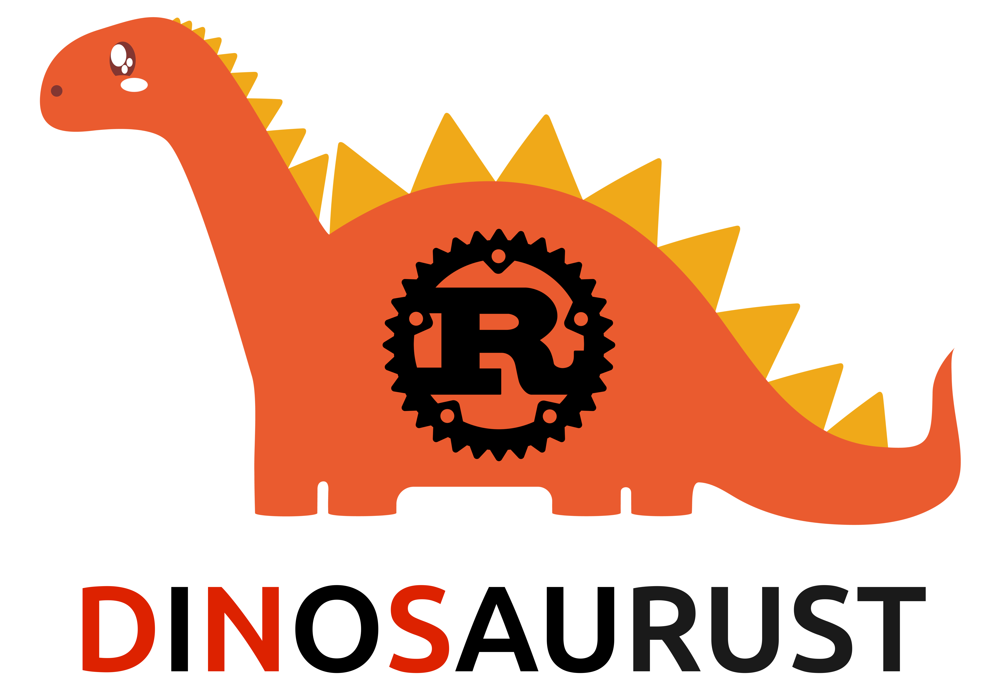

    
    
A DNS server written in Rust

[//]: # (image from https://www.vecteezy.com/vector-art/4959393-nice-orange-dinosaur)

## Roadmap

- [x] Set up UDP server
- [x] Send ping pong
- [x] Write header
- [x] Write answer section
- [x] Parse header
- [x] Parse question section
- [ ] Compress
- [ ] Forward to other server
- [ ] Caching policy
- [ ] Other record types: AAAA, CNAME, NS, etc
- [ ] Maintain own database